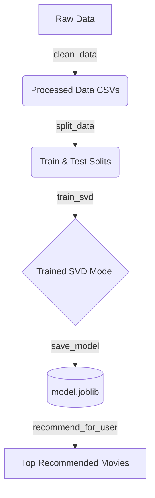

# Movie Recommendation System

A production-style movie recommendation engine utilizing collaborative filtering via the Surprise library (SVD model). Given a MovieLens dataset, it predicts user ratings to suggest new movies uniquely tailored to individual user tastes.

## Usage

This project is built to execute simply from the terminal. The core orchestration happens through `src/main.py`.

```bash
# To run the pipeline entirely (from cleaning data, to training the model, and retrieving recommendations):
python3 src/main.py
```

*Note: You must have raw `ratings.dat` and `movies.dat` files populated within the `data/raw/` directory prior to execution.*

---

## Pipeline Architecture

The system's intelligence works via a sequential background pipeline configured to auto-execute missing steps. Once `src/main.py` is called:

1. **Check Datasets**: The system checks if `.csv` processed data exists. If not, it invokes the Preprocessing Module to construct it from `.dat` source files.
2. **Check Model**: It checks `model.joblib` to see if a pre-trained SVD model already exists. If not, it instantiates the Model Module to train a new one using the processed data.
3. **Execution**: The script then loads the necessary configuration and delegates to the Recommendation Module to yield an actionable DataFrame of purely recommended `Movie Titles` and `Predicted Ratings` for a given `user_id`.



---

## Project Structure and Modules

### `src/preprocessing/`

This module is responsible for mutating raw file dumps into machine-readable datasets.
* **`load_data.py`**: A helper function strictly meant for loading file strings into initial Pandas DataFrames.
* **`clean_data.py`**: Executes aggressive data hygiene loops. It strips duplicate ratings/movies, throws out ratings outside the valid boundary scale, removes users with low activity thresholds, and kicks out unpopular movies lacking reviews to maintain high collaborative data density.
* **`split_data.py`**: Employs a time-based splitting mechanism, dividing user chronologies into testing and training sets.

### `src/model/`

Handles the core Machine Learning intelligence.
* **`svd.py`**: Initiates the Singular Value Decomposition (SVD) Matrix Factorization algorithm. This script is capable of molding `UserId`/`MovieId` pairs over raw datasets efficiently using the `surprise` library and exposes utilities for persisting the trained state (`joblib.dump`).

### `src/recommendation/`

This is where abstract mathematical models get transformed back into human-readable results.
* **`recommend.py`**: Fetches movies the target user *hasn't* seen, runs them individually through the model context to guess their respective ratings, sorts the absolute best predictions, and bundles that back into a `pandas.DataFrame`.

### `src/utils/`

Contains helper scripts defining hardcoded values, file pathways, and reusable helper functions for CSV storage.

### `src/main.py`

The primary conductor orchestrating the whole orchestra of modules into a singular, clean run command.