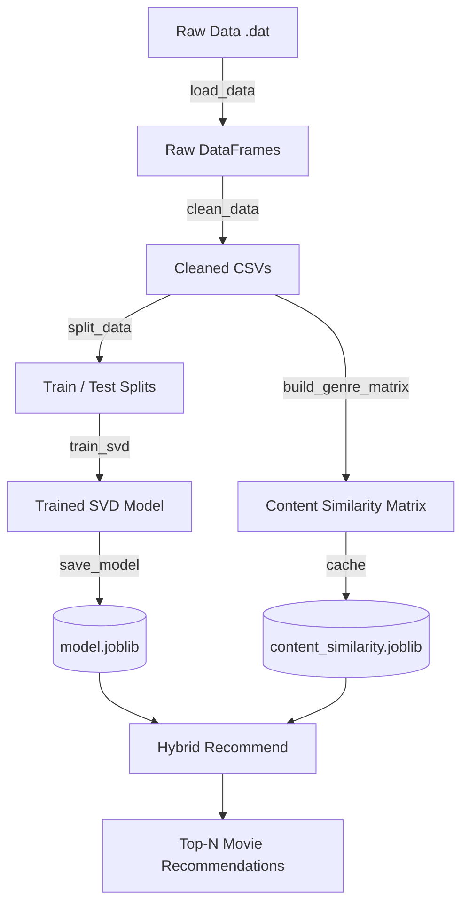

# Movie Recommendation System

A hybrid movie recommendation engine combining **collaborative filtering** (SVD) with **content-based filtering** (genre cosine similarity) to predict user ratings and suggest movies tailored to individual tastes. Includes a Streamlit web interface for interactive use.

Built on the [MovieLens 1M](https://grouplens.org/datasets/movielens/1m/) dataset.

---

## Quick Start

```bash
# Install dependencies
pip install -r requirements.txt

# Run the full pipeline (preprocessing, training, evaluation, recommendations)
python3 src/main.py

# Launch the Streamlit web app
streamlit run app.py
```

> **Note:** Raw `ratings.dat` and `movies.dat` files must be present in `data/raw/` before running.

---

## How It Works

### Recommendation Approach

| Method | Description |
|--------|-------------|
| **Collaborative Filtering (SVD)** | Singular Value Decomposition via the `surprise` library. Learns latent factors from user-item rating patterns. |
| **Content-Based Filtering** | One-hot encodes movie genres into vectors, computes cosine similarity between all movie pairs, and scores unrated movies by weighted similarity to a user's rated movies. |
| **Hybrid** | Blends both scores: `final_score = α * svd_score + (1 - α) * content_score`. The weight `α` is computed dynamically based on how many ratings the user has provided — users with few ratings lean toward content-based (α→0.1), power users lean toward collaborative filtering (α→0.9). |

### Pipeline

```
Raw .dat files
    │
    ▼
Preprocessing (load → clean → split)
    │
    ▼
Processed CSVs (ratings.csv, movies.csv, train.csv, test.csv)
    │
    ├──► SVD Training ──► model.joblib
    │
    ├──► Content Similarity Matrix ──► content_similarity.joblib
    │
    └──► Hybrid Recommendations
```


```mermaid
graph TD
    A[Raw Data .dat] -->|load_data| B[Raw DataFrames]
    B -->|clean_data| C[Cleaned CSVs]
    C -->|split_data| D[Train / Test Splits]
    D -->|train_svd| E[Trained SVD Model]
    E -->|save_model| F[(model.joblib)]
    C -->|build_genre_matrix| G[Content Similarity Matrix]
    G -->|cache| H[(content_similarity.joblib)]
    F --> I[Hybrid Recommend]
    H --> I
    I --> J[Top-N Movie Recommendations]
```

---

## Web App (Streamlit)

```bash
streamlit run app.py
```

The app has three tabs:

| Tab | Description |
|-----|-------------|
| **Pick Movies** | Search and select movies you like, rate them 1–5 stars |
| **Get Recommendations** | View content-based recommendations derived from your picks using the genre similarity matrix |
| **Model Evaluation** | Displays RMSE and MAE metrics for the trained SVD model on the test set |

---

## Project Structure

```
Movie-Recomendation-System/
├── app.py                          # Streamlit web application
├── model.joblib                    # Serialized trained SVD model
├── data/
│   ├── raw/                        # MovieLens 1M .dat files
│   │   ├── ratings.dat
│   │   ├── movies.dat
│   │   └── users.dat
│   └── processed/                  # Cleaned & split data
│       ├── ratings.csv
│       ├── movies.csv
│       ├── train.csv
│       ├── test.csv
│       └── content_similarity.joblib
├── notebooks/
│   └── EDA.ipynb                   # Exploratory data analysis
└── src/
    ├── main.py                     # CLI pipeline orchestrator
    ├── preprocessing/
    │   ├── load_data.py            # .dat/.csv file loading
    │   ├── clean_data.py           # Dedup, outlier removal, user/movie filtering
    │   └── split_data.py           # Time-based train/test split
    ├── model/
    │   ├── svd.py                  # SVD training, save/load via joblib
    │   ├── content_based.py        # Genre matrix, cosine similarity, content scores
    │   └── hybrid.py               # Blended SVD + content-based recommendations
    ├── recommendation/
    │   └── recommend.py            # Pure collaborative filtering recommendations
    ├── evaluation/
    │   └── evaluation.py           # RMSE & MAE evaluation on test set
    └── utils/
        ├── config.py               # Paths, column names, constants
        └── helpers.py              # CSV save utility
```

---

## Module Details

### `src/preprocessing/`

- **`load_data.py`** — Loads `.dat` files into Pandas DataFrames with configurable separators and encodings.
- **`clean_data.py`** — Removes duplicate ratings/movies, filters outlier ratings (outside 1–5), drops inactive users (< 5 ratings) and unpopular movies (< 5 ratings).
- **`split_data.py`** — Time-based split: sorts by timestamp per user, holds out the most recent 20% as the test set.

### `src/model/`

- **`svd.py`** — Trains an SVD model using `surprise.SVD` on the full training set. Saves/loads via `joblib`.
- **`content_based.py`** — Builds a genre one-hot matrix, computes pairwise cosine similarity, and scores unrated movies by weighted similarity to a user's rated movies. Caches the similarity matrix to disk.
- **`hybrid.py`** — Blends SVD and content-based scores with a dynamic `α` weight. `α` ranges from 0.1 (few ratings, trust content) to 0.9 (many ratings, trust collaborative).

### `src/recommendation/`

- **`recommend.py`** — Pure collaborative filtering recommender: predicts ratings for all unrated movies and returns the top-N.

### `src/evaluation/`

- **`evaluation.py`** — Evaluates the SVD model on the test set using RMSE and MAE from `surprise.accuracy`.

### `src/utils/`

- **`config.py`** — Centralized paths (`BASE_DIR`, `RAW_DATA_PATH`, `MODEL_PATH`, etc.), column names, data types, separator, and encoding constants.
- **`helpers.py`** — `save_csv()` utility for writing DataFrames to disk.

---

## Tech Stack

- **Python 3.12**
- **pandas** — Data manipulation
- **scikit-learn** — Cosine similarity
- **surprise** — SVD implementation and evaluation
- **joblib** — Model serialization
- **Streamlit** — Interactive web UI

---

## Data

This project uses the [MovieLens 1M](https://grouplens.org/datasets/movielens/1m/) dataset. Place the following files in `data/raw/`:

- `ratings.dat` — User ratings (`UserID::MovieID::Rating::Timestamp`)
- `movies.dat` — Movie metadata (`MovieID::Title::Genres`)
- `users.dat` — User demographics (`UserID::Gender::Age::Occupation::Zip-code`)

The preprocessing pipeline will automatically clean and split the data on first run.
